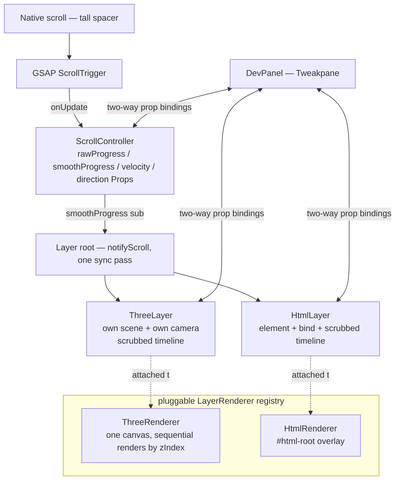

# scroll-engine

A TypeScript engine for scroll-driven 3D websites. Everything connects through subscribable properties; layers are independent renders composited in a stack.

  

## Quick start

```bash
npm install
npm run dev        # http://localhost:5173/?dev=1
```

Press <kbd>`</kbd> (backtick) to toggle the dev panel. `?dev=1` opens it on load.

## Architecture



### Core concepts

- **`Prop<T>`** (`src/core/prop.ts`) — reactive property: synchronous notify on change, `Object.is` equality gate, re-entrancy guard, `derived()` for computed props. Every value in the system is a Prop.
- **`Layer`** (`src/layers/layer.ts`) — renders through a pluggable backend. Layers form a tree; children inherit the parent context. Each layer has `visible` / `opacity` / `zIndex` Props and a `scrollRange` that remaps global scroll progress to a local 0..1.
- **`LayerRenderer`** (`src/core/renderer.ts`) — the plugin interface. `ThreeRenderer` composites every `ThreeLayer` (each with its **own scene and camera**) sequentially on one WebGL canvas, ordered by `zIndex`, depth-cleared between layers. `HtmlRenderer` hosts DOM layers in a fixed overlay. New render tech (Canvas2D, CSS3D, …) = implement the interface; the engine is untouched.
- **`ScrollController`** (`src/core/scrollController.ts`) — one full-page ScrollTrigger writes `rawProgress`; a framerate-independent lerp produces `smoothProgress`; `velocity` and `direction` come along. One synchronous pass notifies every active layer per change.
- **Scrubbed timelines** — layers build paused GSAP timelines; `layer.scrub(timeline)` drives them from the layer's local progress.
- **Singletons** — `Engine`, `ScrollController`, renderers, and `DevPanel` use `create()` / `.instance` / `dispose()`.
- **`DevPanel`** (`src/dev/devPanel.ts`) — Tweakpane bound two-way to the Props: scroll graphs, FPS, smoothing, and a folder per layer.

## Scripts

| Command | What it does |
|---|---|
| `npm run dev` | Vite dev server |
| `npm test` | Vitest unit + behavioural tests |
| `npm run typecheck` | `tsc --noEmit` (strict) |
| `npm run build` | typecheck + production build |

## Writing a layer

```ts
class MyLayer extends ThreeLayer {
  constructor() {
    super('my-layer')
    this.scrollRange = { start: 0.2, end: 0.6 }
  }

  protected override onInit(): void {
    super.onInit()
    // build this.scene, position this.camera…
    this.scrub(gsap.timeline({ paused: true }).to(this.camera.position, { z: 4, duration: 1 }))
  }

  protected override onScroll(scroll: ScrollState): void {
    this.opacity.value = this.localProgress(scroll)
  }
}

Engine.instance.addLayer(new MyLayer())
```
